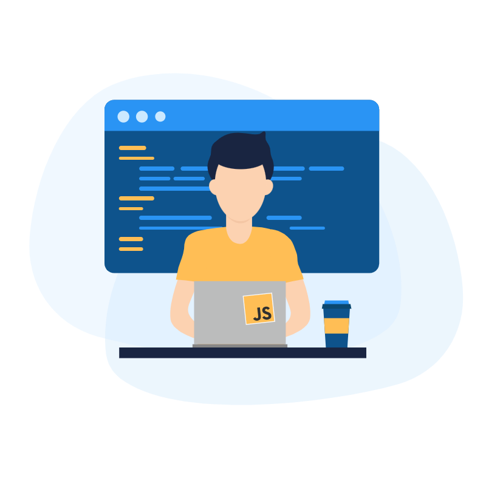

<div align='center'>
  <a href='https://50daysofjavascript.netlify.app'></a>
  <h1>#50DaysOfJavaScript</h1>
  <strong>Solve one question daily to ace 🎯 your next interview!</strong><br/>
  <a href='https://50daysofjavascript.netlify.app/'>50daysofjavascript.netlify.app</a>
  <br/><br/>
  
  <a href='https://github.com/vinitshahdeo/JavaScript-Coding-Interview-Questions/blob/main/50DaysOfJavaScript/README.md'>
    
  </a>
  <br/><br/><br/>
</div>

Similar to the [Hactoberfest'21](https://vinitshahdeo.dev/hacktoberfest-2021) initiative, we're planning another community-led open-source initiative to help the community level up their JavaScript coding skills by solving a non-trivial problem daily. None of the questions will be tricks ━ you don’t have to worry about handling big integers or knowing how to balance a red-black tree. Every problem will be based on what you do daily as a JavaScript developer.

[](https://twitter.com/intent/tweet?text=%2350DaysOfJavaScript%20%E2%80%94%20A%20community-led%20open-source%20initiative%20for%20elevating%20JavaScript%20skills.%0A%0AYou%20can%20join%20as%3A%0A%20%E2%98%91%EF%B8%8F%20Participant%0A%20%E2%98%91%EF%B8%8F%20Mentor%0A%20%E2%98%91%EF%B8%8F%20Community%20Partner%20%20%0A%0ASolve%20one%20question%20daily%20to%20ace%20your%20next%20interview!%20%20%F0%9F%9A%80&url=https%3A%2F%2Fgithub.com%2Fvinitshahdeo%2FJavaScript-Coding-Interview-Questions%2Ftree%2Fmain%2F50DaysOfJavaScript&via=vinit_shahdeo)

[Join `#50DaysOfJavaScript`](https://github.com/vinitshahdeo/JavaScript-Coding-Interview-Questions/blob/main/50DaysOfJavaScript/README.md) ━ **Solve just a single coding challenge each day to improve your JavaScript skills!** This will tentatively start from **Jan 20, 2024**. Begin any day and stick for the next 50 days to complete the challenge. **More details to follow!** ✨

**Learn more**: Visit [50daysofjavascript.netlify.app](https://50daysofjavascript.netlify.app/) | Read Blog on [#50DaysOfJavaScript](https://vinitshahdeo.dev/50daysofjavascript)

> [!NOTE]
> This repository hosts the launch website of **`#50DaysOfJavaScript`** challenge which is currently deployed on [Netlify](https://50daysofjavascript.netlify.app/). <br/><br/>
> [](https://app.netlify.com/sites/50daysofjavascript/deploys)

## Quick links

Calling out **participants**, **mentors**, and **communities** for an open-source initiative—join us to make a difference.

- ***[🏄 Join as a participant](https://github.com/vinitshahdeo/JavaScript-Coding-Interview-Questions/blob/main/50DaysOfJavaScript/README.md#-why-should-you-join-the-challenge)***
- ***[🍿 Become a mentor](https://github.com/vinitshahdeo/JavaScript-Coding-Interview-Questions/blob/main/50DaysOfJavaScript/docs/MENTOR.md)***
- ***[🚀 Collaborate as a community](https://github.com/vinitshahdeo/JavaScript-Coding-Interview-Questions/blob/main/50DaysOfJavaScript/docs/COMMUNITY.md)***


```javascript
console.log('#50DaysOfJavaScript ━ Code awesome stuffs with @vinitshahdeo & friends!');
```

## Official Repository

[](https://github.com/vinitshahdeo/JavaScript-Coding-Interview-Questions)


## Similar initiative

A community-led initiative to help beginners get started with open-source during Hacktoberfest'21—[learn more](https://vinitshahdeo.dev/hacktoberfest-2021)!

[](https://github.com/vinitshahdeo/Hacktoberfest2021)

## Local development

```terminal
npm i
npm start
```

This is created using [create-react-app](https://legacy.reactjs.org/docs/create-a-new-react-app.html) and can be run locally in the development mode using the above commands. Open http://localhost:3000 to view it in your browser.

## Contributors

- [@yashvi2001](https://github.com/yashvi2001)
- [@vinitshahdeo](https://github.com/vinitshahdeo)


## Support

Please help us spread the registration link among your connections—**[tinyurl.com/50DaysOfJavaScript](https://tinyurl.com/50DaysOfJavaScript)**. For any suggestions or feedback, please hit me up on [Twitter](https://twitter.com/Vinit_Shahdeo).

[](https://twitter.com/Vinit_Shahdeo)
